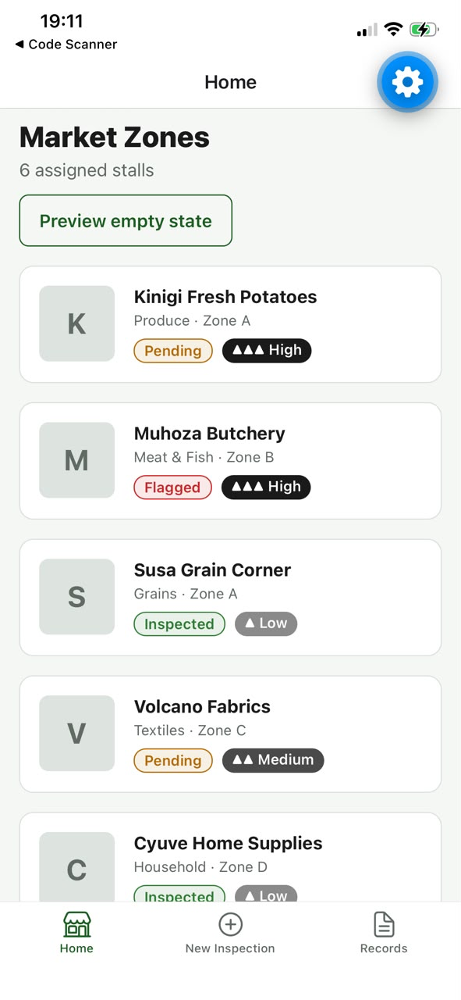
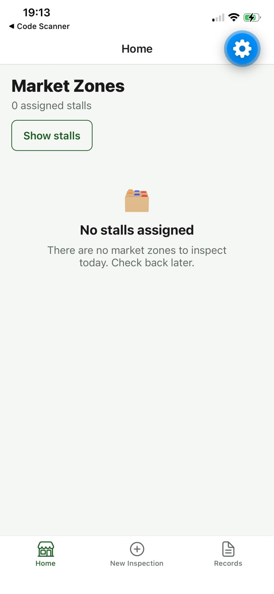
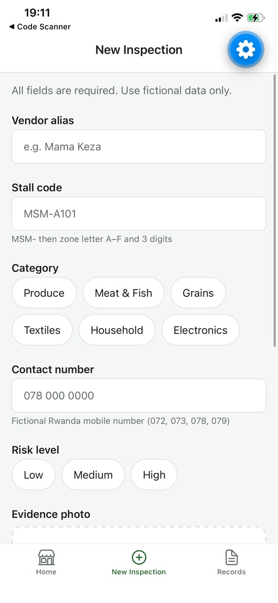
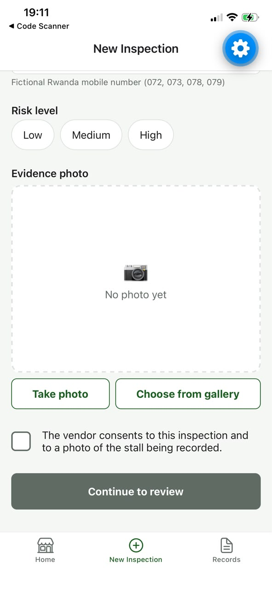
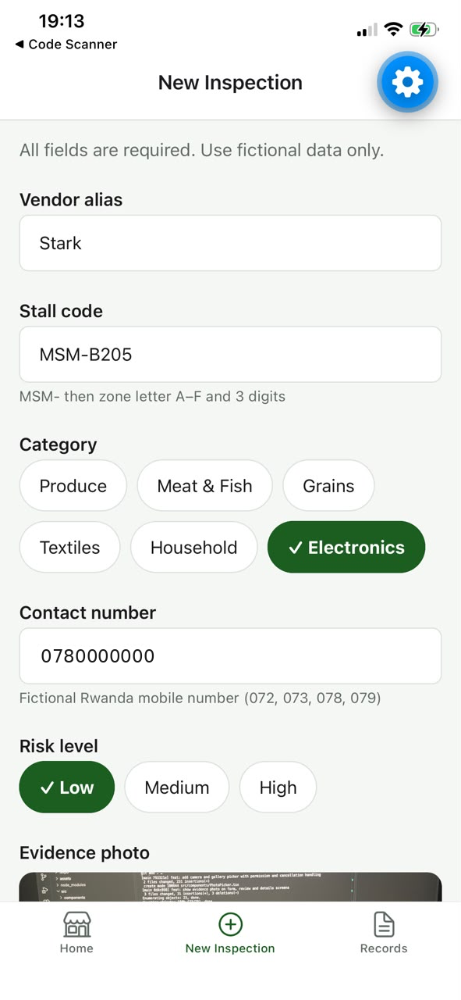
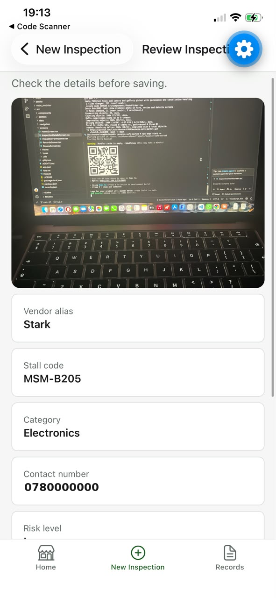
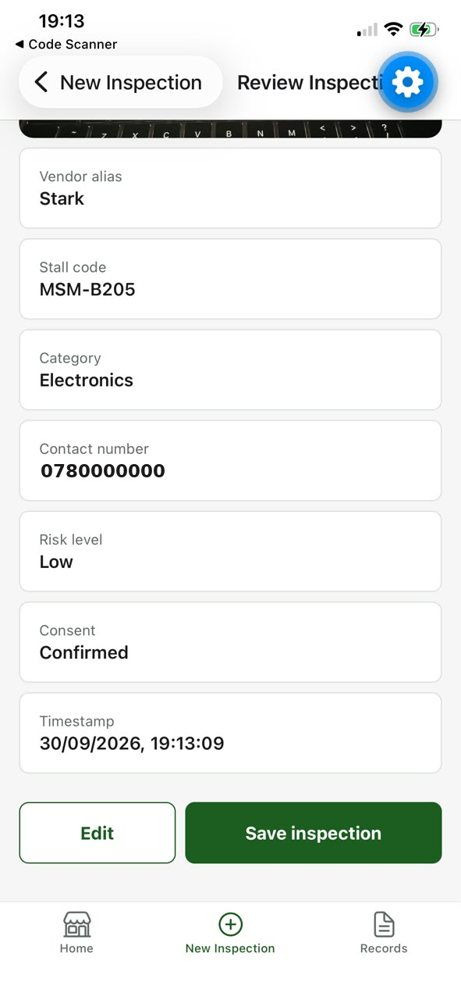
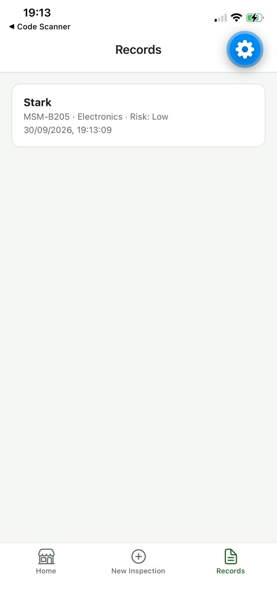

# Musanze Safe Market 🏪

A field inspection mobile app for a fictional market inspection pilot in Musanze, Rwanda.
Field officers can browse assigned market stalls, record vendor inspections with validated
input, attach an evidence photo, and review everything before saving.

Built with **React Native**, **Expo** and **TypeScript**.

## Screenshots

| Catalog | Empty state | Inspection form | Photo picker |
|---|---|---|---|
|  |  |  |  |

| Completed form | Review | Review actions | Records |
|---|---|---|---|
|  |  |  |  |

## Features

- **Market catalog**: reusable card components, status and priority badges, empty state, layout that adapts to large font sizes
- **Validated inspection form**: controlled inputs, whitelist validation with regular expressions (stall code format, Rwanda mobile number format), field-level error messages, submission blocked until valid
- **Navigation**: typed bottom tabs and stack navigation with typed route parameters
- **Camera and gallery**: permission requested only when needed, capture or select, preview, replace, remove, graceful handling of denied permissions and cancellation
- **Review before saving**: data re-validated on the review screen (defense in depth), timestamped records
- **In-memory session state** shared across screens with React Context

## Tech stack

| Area | Tools |
|---|---|
| Framework | React Native, Expo SDK 57 |
| Language | TypeScript |
| Navigation | React Navigation (bottom tabs, native stack) |
| Device | expo-image-picker |
| Layout | Flexbox, StyleSheet |

## Project structure

```
src/
├── components/   Reusable UI (StallCard, FormField, OptionGroup, PhotoPicker…)
├── context/      Shared inspection state (React Context)
├── data/         Fictional stall data and form options
├── navigation/   Tabs, stacks and typed route definitions
├── screens/      Home, form, review, records, details
├── theme/        Colors, spacing, font sizes
├── types/        TypeScript models
└── utils/        Validation rules
```

## Getting started

Requirements: Node.js LTS, and the Expo Go app on your phone.

```bash
git clone https://github.com/Louis-Honore-LOUA/musanze-safe-market.git
cd musanze-safe-market
npm install
npx expo start
```

Scan the QR code with Expo Go (Android) or the Camera app (iOS).

## Validation rules

| Field | Rule |
|---|---|
| Stall code | `MSM-` + zone letter A–F + 3 digits (e.g. `MSM-A101`) |
| Contact number | Rwanda mobile: `07[2,3,8,9]` + 7 digits, or `+250` prefix |
| Vendor alias | 2 to 40 characters |
| Category, risk level, consent, photo | Required |

## Known limitations

- Data is stored in memory only and is lost when the app reloads (no backend or persistent storage)
- All vendor names and phone numbers are fictional

## About

Built as a personal learning project, based on a mobile development course scenario, with AI-assisted guidance.

**Louis Honoré Loua**, Computer Science graduate (Networking), INES-Ruhengeri
[GitHub](https://github.com/Louis-Honore-LOUA)